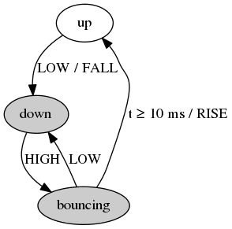
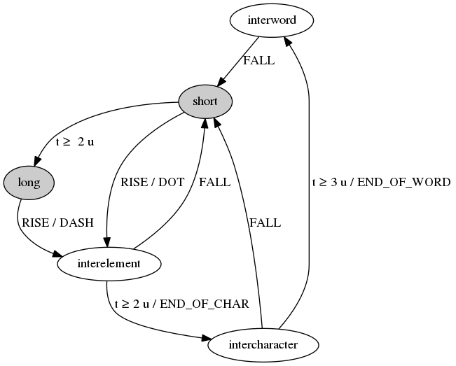

# Internals of tiny-morse-decoder

This is an overview of the internals of the program
[tiny-morse-decoder.c](tiny-morse-decoder.c). The sections in this
document mirror the sections in the source file. It is suggested to read
this document and the source code side by side. The comments in the
source provide a lower level, more fine grained documentation, athough
there is significant overlap between those comments and this document.

The microcontroller is clocked at `F_CPU`&nbsp;=&nbsp;9.6&nbsp;MHz by
its internal RC oscillator.

The data path is: input → edge detector → tokenizer → decoder → UART →
output.

## Timekeeping

The ATtiny13A has a single timer, which is used both for driving the
software UART and for timekeeping. It is driven by the system clock
prescaled by a factor&nbsp;8. It is configured to count from 0 to
`TIMER_TOP` =&nbsp;124, then reset to zero and start again. The reset
frequency is then

9.6 MHz ÷ 8 ÷ 125 = 9.6 kHz.

which is also the output baud rate. The timer can generate up to two
interrupts per period:

* `TIM0_COMPA`, which is always active, is used for counting “system
  tics”
* `TIM0_COMPB`, which is active only when transmitting, drives the
  software UART.

The available timekeeping functions are:
* `tics()`: returns the current time is system tics. This rolls over to
  zero every 6.83&nbsp;seconds but, owing to the rules of modular
  arithmetics, [the rollover is not an issue][rollover].
* `expired()`: returns `true` if a timeout has expired, `false`
  otherwise. This function performs an unsigned to signed conversion
  which can potentially overflow, invoking implementation-defined
  behavior. However, [gcc does the only sensible thing][gcc behavior],
  which is to not change the internal representation of the number,
  effectively reducing it modulo 2<sup>bit width</sup>.
* `delay()` does what it promises. Since this is a blocking function, it
  should only be used during program startup.

[rollover]: https://arduino.stackexchange.com/questions/12587/how-can-i-handle-the-millis-rollover
[gcc behavior]: https://gcc.gnu.org/onlinedocs/gcc/Integers-implementation.html

## Keying speed selection

The input pins `PB0` and `PB1` are read as a binary number between 0 and
3, which is then used to index an array of “dot times” corresponding to
the available speeds. The “dot time”, or expected length of a dot, is
the base unit of Morse keying timing. Then, the global variables
`delay_1u`, `delay_2u` and `delay_3u` are initialized with multiples of
this base unit. These variables are themselves in system tics.

Since the default is to leave the pins floating, and a floating pin
reads as binary&nbsp;1, the default (slowest) speed is at index&nbsp;3
(binary:&nbsp;11).

## Edge detector

The edge detector monitors the pin connected to the telegraph key and
delivers `RISE` and `FALL` events which are fed to the tokenizer. It
implements an asymmetric debouncer based on the notion that the key can
only bounce when it is in the down position:

* when the key is up, a `FALL` event is generated as soon as the input
  pin reads `LOW`, the key is then assumed to be in the down position
* when the key is down, a `HIGH` input reading is assumed to be a
  mechanical bounce
* a `RISE` event is generated only after the input has been consistently
  `HIGH` for 10&nbsp;ms, at which point the key is assumed to be up.

The edge detector is a [finite state machine][FSM] implementing the
following state diagram:



In the above diagram, states with a gray background are those where the
key is assumed to be down. Transitions are labeled with the event that
triggers them. Transitions that generate an output event are labeled
_trigger_&nbsp;/&nbsp;_output_, where _trigger_ is the input event that
triggers the transition, and _output_ is the generated output event. For
example, the transition from the “up” state to the “down” state is
triggered by the input pin reading `LOW` and generates a `FALL` event.

The source code of `get_edge()` is essentially a literal translation of
the above state diagram.

[FSM]: https://en.wikipedia.org/wiki/Finite-state_machine

## Tokenizer

The tokenizer translates the `RISE` and `FALL` events generated by the
edge detector into a stream of symbols among: `DOT`, `DASH`,
`END_OF_CHAR` and `END_OF_WORD`. Note that `END_OF_WORD` is always
preceded by `END_OF_CHAR`. The tokenizer works by timing the delays
between the `RISE` and `FALL` events, and comparing these delays to
specific thresholds.

The standard Morse timing is:

| element            | duration |
|--------------------|:--------:|
| dot                |     1    |
| dash               |     3    |
| interelement gap   |     1    |
| intercharacter gap |     3    |
| interword gap      |     7    |

where the duration of a dot is the base time unit. Then, the thresholds
for discriminating a dot from a dash, and for classifying gaps, are set
to the averages of the expected durations:

| threshold                         | duration |
|-----------------------------------|:--------:|
| dot / dash                        |     2    |
| interelement / intercharacter gap |     2    |
| intercharacter / interword gap    |     5    |

The tokenizer is also a state machine:



Note that the `DOT` and `DASH` symbols are generated on `RISE` events
(when the key goes up), whereas the `END_OF_CHAR` and `END_OF_WORD`
symbols are generated on timeouts (while the key is up). Note also that
a long gap generates an `END_OF_CHAR` symbol two time units after the
`RISE` event, followed, three time units later, by an `END_OF_WORD`
symbol.

The function `tokenize()` is essentially a literal translation of the
above state diagram.

## Decoder

The decoder translates the above mentioned symbols into a string of
ASCII charaters. Each character is translated by following these steps:

1. the symbols are converted to a bit stream per the rules:
   * `DOT` → 1
   * `DASH` → 0, 1
2. the bit stream is read backwards (lest significant bit first) as a
   binary number
3. this “code number” is looked-up in the array `morse_code`
4. if found, adding 32 (ASCII space) to the array index gives the
   character's ASCII code, with the exception that index 0 encodes
   `'_'` rather than space.

**Example**: The sequence (`DASH`, `DOT`, `DASH`) gives the bit stream
(0, 1, 1, 0, 1) which, read backwards, is the binary number 10110
=&nbsp;decimal&nbsp;22. This number can be found in the `morse_code`
array at index&nbsp;43. Then, 43 +&nbsp;32 is 75, which is the ASCII
code for the letter K.

In practice, steps&nbsp;1 and 2 are merged into a single step: the bit
stream is built as an integer to start with, using bit-level operations.
Steps&nbsp;3 and 4 are perfomed by the function `code_to_char()` upon
receiving the `END_OF_CHAR` symbol. The `END_OF_WORD` symbol is simply
translated to an ASCII space.

This technique allows for a very compact representation of the Morse
code as an array of 59 16-bit integers:
* 54 of these integers encode all the Morse codes known by the program
* 5 zeros stand for characters with no known Morse representation (#, %,
  \*, &lt;, and &gt;).

The `morse_code` array was obviously not written by hand: it was
generated by the the program mkcode.c, available in the [tools](tools/)
directory.

## Software UART transmitter

This is a software implementation of an asynchronous serial transmitter.
The term “UART”, which stands for “universal asynchronous
receiver-transmitter”, is a misnomer, since this is neither universal
(it only supports 9600/8N1) nor a receiver. It is used here nevertheless
only because it is familiar.

This transmitter is built on a 16-bit shift register. The function
`uart_putchar()` is used to transmit a character: it takes the 8-bit
character to be transmitted, adds the start and stop bits, and puts it
in the shift register. The binary pattern in the shift register is then

    0000001XXXXXXXX0

where `XXXXXXXX` are the eight bits of the character, the rightmost 0
is the start bit, and the leftmost 1 is the stop bit. Once the shift
register has been initialized, the interrupt `TIM0_COMPB` is enabled,
which then fires at the serial bit rate.

The bits in the shift register are then sent, one at at time and least
significant first, by the corresponding interrupt service routine. Once
the stop bit has been shifted out, the shift register is all zeros, at
which point the interrupt is disabled.

## Main program

The main program does the required initializations, then sends the
“invitation to transmit” code to the LED, then goes into an infinite
data-processing loop. This loop is a straightforward implementation of
the data pipeline: edge detector → tokenizer → decoder → UART:

```c
for (;;) {
    edge_t edge = get_edge();
    symbol_t sym = tokenize(edge);
    char c = decode(sym);
    if (c)
        uart_putchar(c);
}
```

Everything in this loop is non blocking. Most of the time:
* `get_edge()` returns `NO_EDGE`
* `tokenize()` returns `NO_SYMBOL`
* `decode()` returns `0`
* nothing is sent to the UART.

It is important that the loop is non-blocking because the state machines
`get_edge()` and `tokenize()` have to run often enough in order to
properly handle their timeout-trigered transitions.
